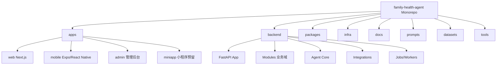
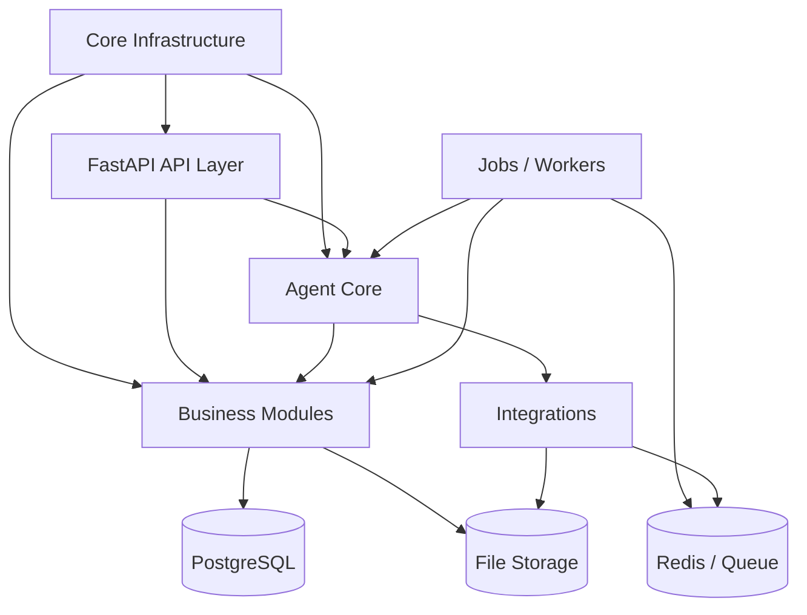
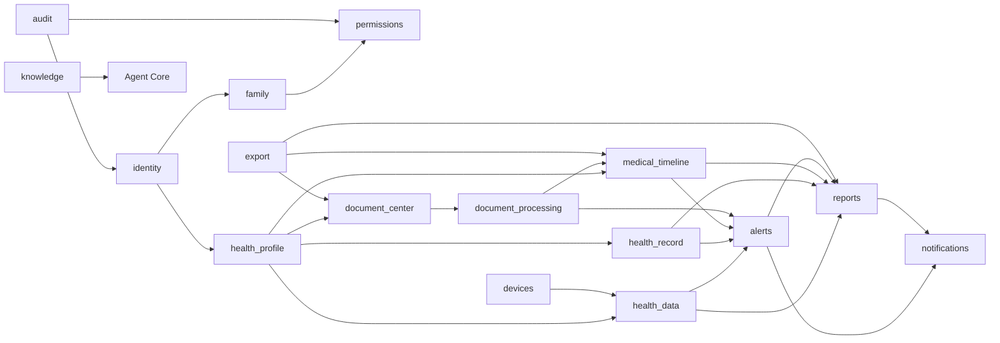
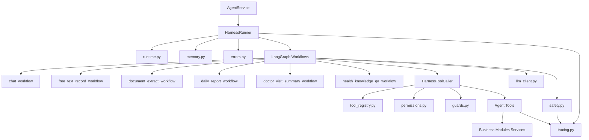
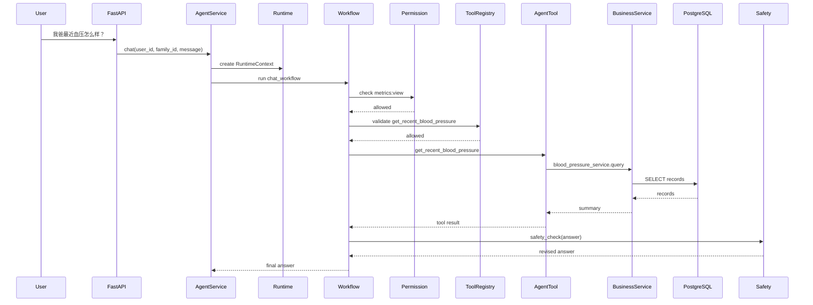
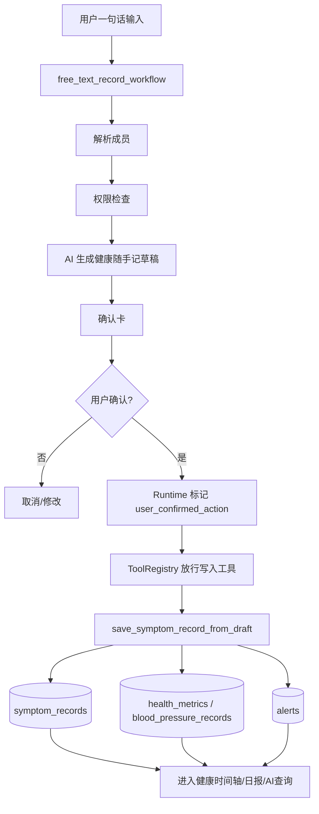
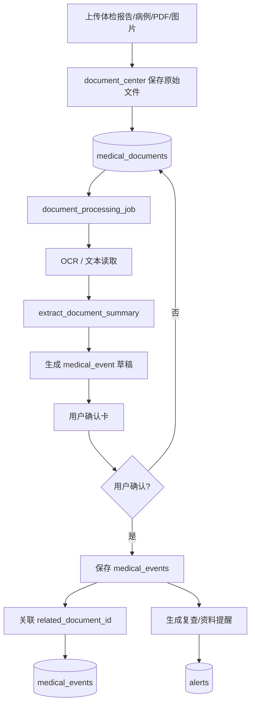
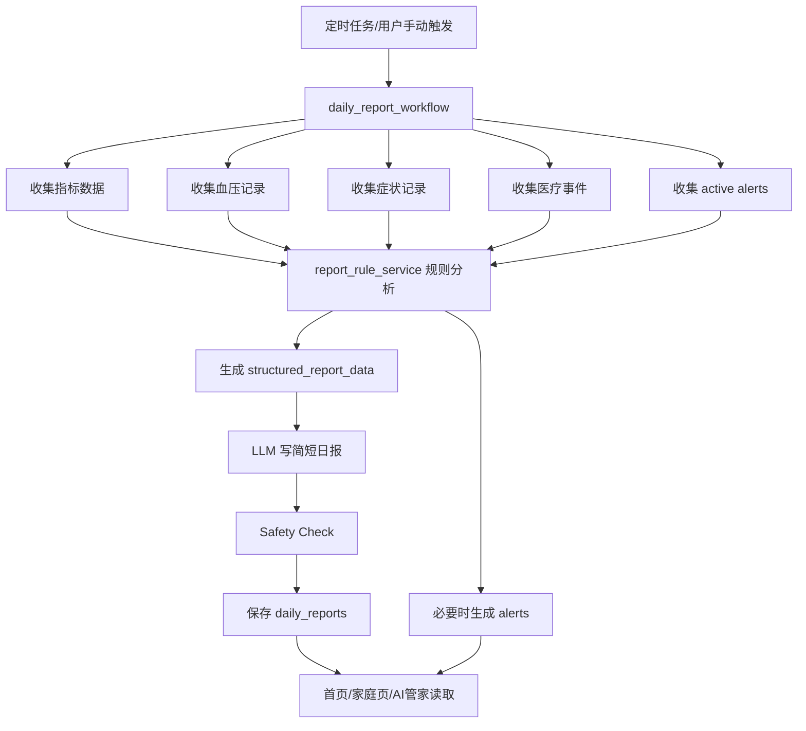
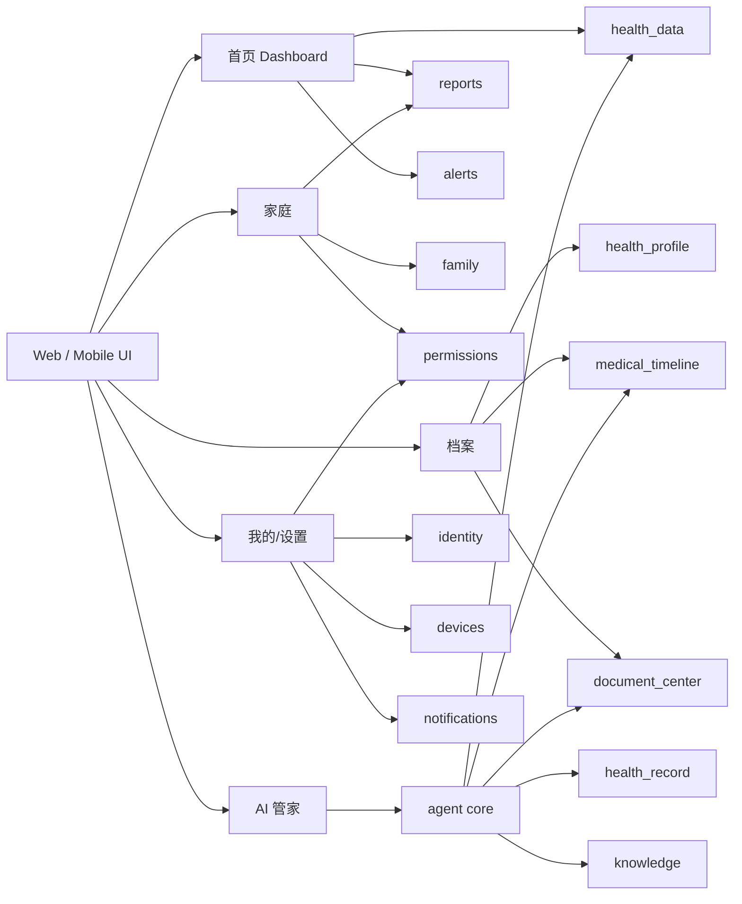

# Family Health Agent 项目架构设计 v1.0

> 架构原则：产品第一版可以 MVP，但项目文件夹架构必须按最终成品级系统设计。  
> 工程形态：Monorepo + 模块化单体后端 + 多前端入口 + Agent Core 独立域。

## 1. 架构总判断

Family Health Agent 是面向家庭长期使用的个人健康档案、家庭健康共享与 AI 健康管家系统。架构不是为一次 Demo 临时拼出来，而是为后续 Web、移动端、小程序、设备接入、文档识别、日报提醒、知识库 RAG、就医资料导出、审计后台等能力预留完整边界。

本项目采用 **模块化单体 Modular Monolith**：

- 代码按最终业务域拆清楚。
- 数据库先统一使用 PostgreSQL。
- 部署先一个后端服务。
- Agent Core 独立于业务 modules，但通过 service 调用业务能力。
- 后续可按压力和边界拆分 document、agent、notification、device 等服务。

## 2. 顶层目录

```text
family-health-agent/
|-- apps/
|   |-- web/
|   |-- mobile/
|   |-- admin/
|   `-- miniapp/
|-- backend/
|   |-- app/
|   |-- alembic/
|   |-- tests/
|   |-- scripts/
|   |-- workers/
|   `-- storage/
|-- packages/
|   |-- shared-types/
|   |-- ui-kit/
|   `-- api-client/
|-- infra/
|   |-- docker/
|   |-- nginx/
|   |-- postgres/
|   |-- redis/
|   |-- minio/
|   `-- observability/
|-- docs/
|   |-- product/
|   |-- architecture/
|   |-- database/
|   |-- api/
|   |-- agent/
|   |-- operations/
|   `-- decisions/
|-- prompts/
|-- datasets/
|-- tools/
|-- docker-compose.yml
|-- docker-compose.dev.yml
|-- .env.example
|-- README.md
`-- Makefile
```

## 3. apps 前端目录

```text
apps/
|-- web/
|   |-- app/
|   |   |-- dashboard/
|   |   |-- family/
|   |   |-- members/
|   |   |-- records/
|   |   |-- documents/
|   |   |-- reports/
|   |   |-- alerts/
|   |   |-- agent/
|   |   |-- settings/
|   |   `-- auth/
|   |-- components/
|   |   |-- dashboard/
|   |   |-- family/
|   |   |-- health-data/
|   |   |-- health-record/
|   |   |-- medical-timeline/
|   |   |-- documents/
|   |   |-- reports/
|   |   |-- alerts/
|   |   |-- agent/
|   |   `-- common/
|   |-- lib/
|   |-- hooks/
|   |-- styles/
|   `-- public/
|-- mobile/
|   |-- app/
|   |-- components/
|   |-- lib/
|   `-- assets/
|-- admin/
|   |-- app/
|   |-- components/
|   `-- lib/
`-- miniapp/
    |-- pages/
    `-- components/
```

## 4. backend 后端总目录

```text
backend/app/
|-- main.py
|-- core/
|   |-- config.py
|   |-- security.py
|   |-- logging.py
|   |-- exceptions.py
|   |-- constants.py
|   |-- permissions.py
|   |-- pagination.py
|   |-- time_utils.py
|   `-- environment.py
|-- db/
|   |-- session.py
|   |-- base.py
|   |-- init_db.py
|   |-- transaction.py
|   `-- mixins.py
|-- api/
|-- modules/
|-- agent/
|-- integrations/
|-- jobs/
|-- workers/
|-- common/
`-- utils/
```

## 5. modules 业务域目录

```text
backend/app/modules/
|-- identity/
|   |-- models.py
|   |-- schemas.py
|   |-- repository.py
|   |-- service.py
|   |-- api.py
|   |-- password.py
|   |-- token.py
|   `-- oauth/
|       |-- wechat.py
|       |-- apple.py
|       `-- google.py
|-- family/
|   |-- models.py
|   |-- schemas.py
|   |-- repository.py
|   |-- service.py
|   |-- api.py
|   |-- member_resolver.py
|   |-- invitation.py
|   `-- enums.py
|-- permissions/
|   |-- models.py
|   |-- schemas.py
|   |-- repository.py
|   |-- service.py
|   |-- api.py
|   |-- policy.py
|   `-- enums.py
|-- health_profile/
|   |-- models.py
|   |-- schemas.py
|   |-- repository.py
|   |-- service.py
|   |-- api.py
|   `-- summary.py
|-- health_data/
|   |-- models.py
|   |-- schemas.py
|   |-- repository.py
|   |-- service.py
|   |-- api.py
|   |-- metric_types.py
|   |-- blood_pressure.py
|   |-- importers/
|   `-- rules/
|-- health_record/
|   |-- models.py
|   |-- schemas.py
|   |-- repository.py
|   |-- service.py
|   |-- api.py
|   |-- extraction.py
|   |-- confirmation.py
|   |-- timeline_adapter.py
|   `-- rules.py
|-- medical_timeline/
|-- document_center/
|-- document_processing/
|-- reports/
|-- alerts/
|-- devices/
|-- notifications/
|-- knowledge/
|-- export/
|-- audit/
`-- admin/
```

### 5.1 health_data

```text
modules/health_data/
|-- models.py
|-- schemas.py
|-- repository.py
|-- service.py
|-- api.py
|-- metric_types.py
|-- blood_pressure.py
|-- importers/
|   |-- csv_importer.py
|   |-- excel_importer.py
|   `-- manual_importer.py
`-- rules/
    |-- metric_rules.py
    |-- blood_pressure_rules.py
    |-- sleep_rules.py
    `-- activity_rules.py
```

### 5.2 document_processing

```text
modules/document_processing/
|-- models.py
|-- schemas.py
|-- repository.py
|-- service.py
|-- api.py
|-- pipeline.py
|-- ocr/
|   |-- base.py
|   |-- local_ocr.py
|   `-- cloud_ocr.py
|-- extractors/
|   |-- checkup_report_extractor.py
|   |-- lab_test_extractor.py
|   |-- prescription_extractor.py
|   `-- discharge_summary_extractor.py
|-- confirmation.py
`-- tasks.py
```

### 5.3 reports

```text
modules/reports/
|-- models.py
|-- schemas.py
|-- repository.py
|-- service.py
|-- api.py
|-- daily/
|   |-- generator.py
|   |-- rules.py
|   `-- renderer.py
|-- weekly/
|   |-- generator.py
|   |-- rules.py
|   `-- renderer.py
`-- family/
    |-- family_summary.py
    `-- family_weekly.py
```

### 5.4 devices

```text
modules/devices/
|-- models.py
|-- schemas.py
|-- repository.py
|-- service.py
|-- api.py
|-- adapters/
|   |-- base.py
|   |-- apple_health.py
|   |-- google_fit.py
|   |-- huawei_health.py
|   |-- xiaomi_health.py
|   |-- fitbit.py
|   `-- blood_pressure_device.py
`-- sync/
    |-- scheduler.py
    |-- normalizer.py
    `-- deduplicator.py
```

### 5.5 knowledge

```text
modules/knowledge/
|-- models.py
|-- schemas.py
|-- repository.py
|-- service.py
|-- api.py
|-- ingestion/
|   |-- loader.py
|   |-- splitter.py
|   `-- embedder.py
|-- retrieval/
|   |-- retriever.py
|   `-- reranker.py
`-- safety/
    `-- source_policy.py
```

### 5.6 export

```text
modules/export/
|-- models.py
|-- schemas.py
|-- repository.py
|-- service.py
|-- api.py
|-- renderers/
|   |-- pdf_renderer.py
|   |-- markdown_renderer.py
|   `-- html_renderer.py
`-- packages/
    |-- doctor_visit_package.py
    `-- medical_record_package.py
```

## 6. Agent Core 目录

```text
backend/app/agent/
|-- service.py
|-- llm_client.py
|-- schemas/
|-- prompts/
|-- harness/
|   |-- runtime.py
|   |-- permissions.py
|   |-- tool_registry.py
|   |-- safety.py
|   |-- tracing.py
|   |-- memory.py
|   |-- errors.py
|   |-- guards.py
|   |-- runner.py
|   `-- tool_caller.py
|-- tools/
|   |-- member_tools.py
|   |-- permission_tools.py
|   |-- profile_tools.py
|   |-- metric_tools.py
|   |-- blood_pressure_tools.py
|   |-- symptom_tools.py
|   |-- medical_event_tools.py
|   |-- document_tools.py
|   |-- report_tools.py
|   |-- alert_tools.py
|   |-- knowledge_tools.py
|   |-- export_tools.py
|   `-- device_tools.py
|-- workflows/
|   |-- chat_workflow.py
|   |-- free_text_record_workflow.py
|   |-- document_extract_workflow.py
|   |-- daily_report_workflow.py
|   |-- doctor_visit_summary_workflow.py
|   |-- health_knowledge_qa_workflow.py
|   |-- family_summary_workflow.py
|   |-- weekly_report_workflow.py
|   |-- device_sync_review_workflow.py
|   `-- export_workflow.py
|-- rules/
|   |-- daily_report_rules.py
|   |-- metric_trend_rules.py
|   |-- blood_pressure_rules.py
|   |-- symptom_follow_up_rules.py
|   |-- alert_rules.py
|   |-- document_review_rules.py
|   `-- data_quality_rules.py
|-- memory/
|-- evaluators/
`-- tests/
```

## 7. integrations 外部集成目录

```text
backend/app/integrations/
|-- llm/
|   |-- openai_compatible.py
|   |-- claude.py
|   |-- gemini.py
|   `-- mock.py
|-- storage/
|   |-- local.py
|   |-- s3.py
|   |-- minio.py
|   `-- oss.py
|-- ocr/
|   |-- base.py
|   |-- paddle_ocr.py
|   `-- cloud_ocr.py
|-- health_platforms/
|   |-- apple_health.py
|   |-- google_fit.py
|   |-- huawei.py
|   `-- xiaomi.py
|-- messaging/
|   |-- email.py
|   |-- sms.py
|   |-- push.py
|   `-- wechat.py
`-- observability/
    |-- sentry.py
    `-- opentelemetry.py
```

## 8. jobs / workers 目录

```text
backend/app/jobs/
|-- scheduler.py
|-- daily_report_job.py
|-- weekly_report_job.py
|-- alert_check_job.py
|-- device_sync_job.py
|-- document_processing_job.py
|-- notification_job.py
`-- cleanup_job.py

backend/app/workers/
|-- celery_app.py
|-- queues.py
|-- document_worker.py
|-- report_worker.py
|-- notification_worker.py
|-- device_sync_worker.py
`-- agent_worker.py
```

## 9. tests 测试目录

```text
backend/tests/
|-- unit/
|   |-- modules/
|   |-- agent/
|   `-- integrations/
|-- integration/
|   |-- api/
|   |-- database/
|   |-- agent_flows/
|   `-- document_pipeline/
|-- e2e/
|   |-- health_record_flow_test.py
|   |-- daily_report_flow_test.py
|   |-- document_extract_flow_test.py
|   `-- doctor_visit_summary_flow_test.py
`-- fixtures/
    |-- demo_users.py
    |-- demo_family.py
    |-- demo_metrics.py
    `-- demo_documents.py
```

## 10. docs 文档目录

```text
docs/
|-- product/
|   |-- PRD.md
|   |-- product_direction.md
|   `-- user_stories.md
|-- architecture/
|   |-- system_architecture.md
|   |-- folder_architecture.md
|   |-- module_boundaries.md
|   |-- deployment_architecture.md
|   `-- architecture_decision_records/
|-- database/
|   |-- erd.md
|   |-- tables.md
|   `-- migrations.md
|-- api/
|   |-- api_spec.md
|   `-- openapi.md
|-- agent/
|   |-- agent_tools.md
|   |-- langgraph_workflows.md
|   |-- harness.md
|   |-- safety.md
|   `-- prompts.md
|-- operations/
`-- decisions/
```

## 11. 业务模块职责表

| 模块 | 核心职责 | 关键数据 |
|---|---|---|
| identity | 用户账号、登录、第三方账号、Token | users, user_auth_accounts |
| family | 家庭空间、成员关系、邀请、成员解析 | families, family_members |
| permissions | 家庭共享权限、协助记录权限、权限审计 | member_share_permissions |
| health_profile | 基础健康档案、慢病/过敏/用药摘要 | health_profiles |
| health_data | 指标、血压、睡眠、步数、体重等数据 | health_metrics, blood_pressure_records |
| health_record | 健康随手记、症状记录、AI 草稿确认 | symptom_records, health_record_drafts |
| medical_timeline | 体检、手术、用药、过敏、复查等正式事件 | medical_events |
| document_center | 原始资料上传、存储、元信息、访问控制 | medical_documents |
| document_processing | OCR、文档解析、AI 摘要、事件草稿 | document_processing_jobs, extraction_results |
| reports | 每日/每周/家庭报告、规则分析、渲染 | daily_reports, weekly_reports |
| alerts | 指标关注、复查、用药、资料待确认、症状随访 | alerts, alert_events |
| devices | 手环、手机健康平台、体脂秤、血压计接入 | device_bindings, raw_device_data |
| notifications | 站内、邮件、短信、Push、微信通知 | notification_logs |
| knowledge | 健康知识库、RAG、来源策略 | knowledge_documents, knowledge_chunks |
| export | 就医摘要、PDF、Markdown、资料包、分享链接 | export_jobs, share_links |
| audit | 数据访问审计、隐私事件、Agent Trace 查看 | audit_logs, data_access_logs |
| admin | 运营后台、用户排查、文档队列、Agent 监控 | 管理视图 |

## 12. 架构图

### 12.1 项目顶层架构图



### 12.2 后端模块化单体架构



### 12.3 业务域依赖图



### 12.4 Agent Core 架构图



### 12.5 数据访问安全链路



### 12.6 写入链路



### 12.7 文档处理链路



### 12.8 日报生成链路



### 12.9 前端页面与后端模块映射



## 13. 关键工程原则

1. 架构按最终成品设计，功能分阶段点亮。
2. 业务事实归 modules 的数据库表，不归 LLM Memory。
3. Agent 不直接操作数据库，必须通过 Agent Tools 调用 Business Service。
4. 家庭成员数据查询必须经过成员解析和权限检查。
5. 写入健康档案必须经过 AI 草稿、用户确认、Tool Registry 放行。
6. 日报和提醒遵循“规则算事实，LLM 写表达”。
7. Safety Check 贯穿回答、确认卡、日报和就医摘要。
8. Document Processing 和 Device Integration 一开始预留完整边界，第一阶段可不启用。
9. Notification、Export、Audit、Admin 都是成品级系统的一部分，不在 MVP 中临时拼。
10. 所有核心 Agent 能力必须有 tracing 和错误降级。

## 14. Phase 策略

| 阶段 | 产品能力 | 架构状态 |
|---|---|---|
| Phase 1 | Web、家庭成员、指标、血压、健康随手记、日报、AI 查询 | 完整目录一次搭好，核心模块 minimal 实现 |
| Phase 2 | 文档上传识别、就医摘要、更多提醒、周报 | 启用 document_center / document_processing / export |
| Phase 3 | 设备同步、通知、RAG、移动端 | 启用 devices / notifications / knowledge / mobile |
| Phase 4 | 后台、审计、规模化任务、服务拆分 | 强化 audit / admin / workers / observability |
