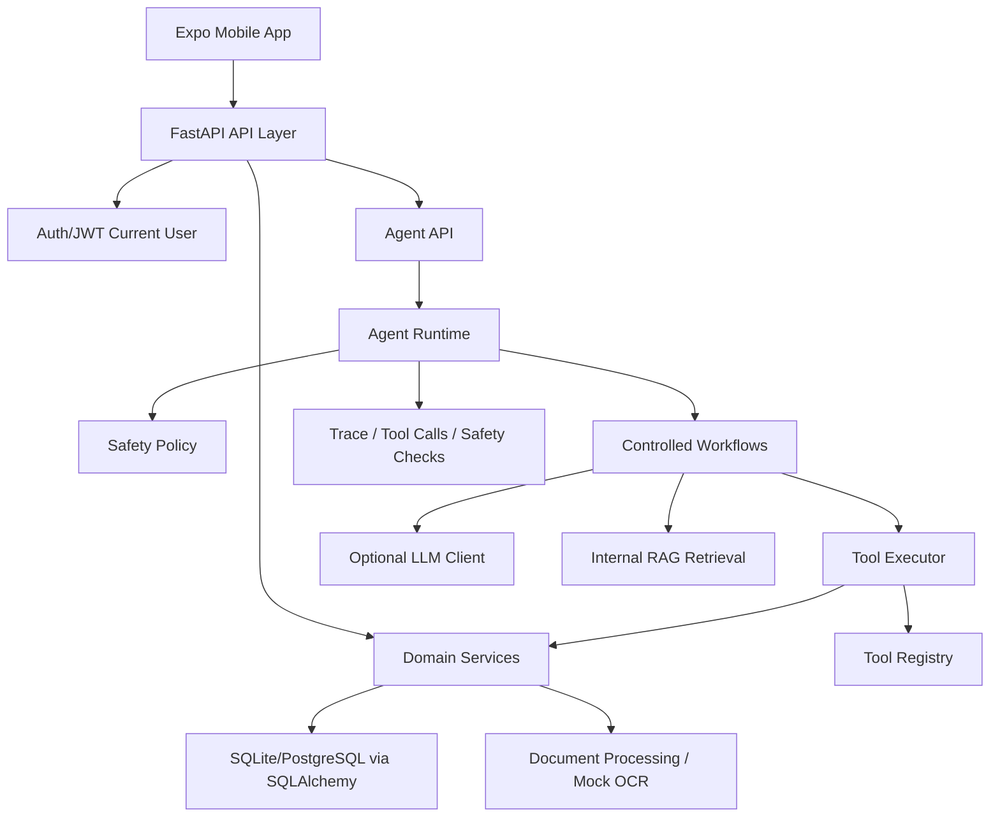

# 架构总结

## Mobile App

Expo + React Native + Expo Router。支持 mock、api、api-auth 模式，用于演示家庭健康管理、Agent workflow、文档处理和调试信息。

## API Layer

API 层只接收请求、校验参数、调用 service 或 Agent runtime。不承载核心业务决策。

## Service Layer

业务逻辑集中在 domain service。Repository 只负责数据库读写。

## Database

当前支持 SQLite 开发演示路径和 PostgreSQL 预留路径。Alembic 管理 migration。

## Agent Runtime

Agent Runtime 管理 run context、trace 状态、workflow 调用、input/output safety。

## Tool Executor

Tool Executor 统一执行工具 metadata 校验、confirmation、permission、tool_call 记录和安全摘要。

## LLM Client

LLM Client 是底层文本生成适配层，不直接查数据库、不调用 tool、不写数据。默认关闭。

## Document Processing

文档上传后可创建 processing job，mock OCR 只生成安全 preview 和 structured hints。

## RAG Retrieval

RAG 当前是内部 simple retrieval，只检索系统内安全摘要，并返回 citations。

## Audit / Trace / Safety

权限、data access logs、agent traces、tool calls、safety checks 共同构成可追踪链路。

